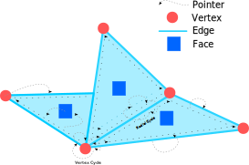

# Redges, a Radial Edge implementation
 
## The Radial Edge
A radial edge is a data structure for topological operations. That is, operations such as finding all vertices
connected by an edge to a given vertex, finding all triangles sharing a given edge, finding the edge between two
vertices... And more.



Although similar to a Half Edge, a Radial Edge can represent non-manifold topology via the introduction of edge structs. The abstract definition of the components of a radial edge is as follows:  
  
  - Vertex, Contains: 
  	- geometry data (e.g. positions, normals).
    - Pointer to any edge incident on the vertex.
 
  - Edge, Contains: 
      - Per edge data (e.g. colour label)
      - Two pointers to circular-doubly-linked lists of edges on the extremities (each endpoint has a list of all the edges that share that vertex).
      - Pointer to any half edge in any face incident on the edge,
      - Two pointer to vertices, one for each endpoint vertex.
 
 - Half Edge, Contains:
 	- Pointer to the Edge this Half Edge is parallel to.
 	- Pointer to the Face containing this Half Edge.
 	
- Face, Contain:
	- Geometry data like face normal, per face uvs...
	- Pointer to any Half Edge contained in the face.

## Contributing

Contributions are subject to a CLA. The CLA document will be published soon; in the mean time, contact us at licensing@fslabs.ca if you wish to contribute.

## API  
  
 Redges is implemented with genericity in mind. It abstracts over the underlying vertex implementation, so it's agnostic to both the linear algebra API and even the dimension. It is possible to represent meshes in any arbitrary ambient space.
 
 It strives to be performant, robust and ergonomic to use. Meaning algorithms are implemented as optimally as possible while maintianing genericity and conciceness and without sacrificing precision and algorithmic correctness.
 
 ### Additive editing  

Additive editing includes operations such as edge flipping, edge splitting, adding vertices, faces, edges...

And example of loading a mesh and inserting new elements through edge_splitting can be seen here:
   
 
```rust
// Load mesh data
let mut obj_data = ObjData::from_disk_file("assets/armadillo.obj");  
let vertices: Vec<_> = obj_data
        .vertices
        .iter()
        .map(|v| v.map(|s| s as f64))
        .collect();

let indices: Vec<_> = obj_data
    .vertex_face_indices
    .iter()
    .map(|l| {
        l.clone()
            .into_iter()
            .map(|i| i as usize)
            .collect::<Vec<_>>()
    })
    .collect();
  
// Initialize the radial edge
let redge = Redge::<(_, _, _)>::new(
    vertices,
    (),
    faces,
    indices.iter().map(|f| f.iter().copied()),
);
  
// Edit the mesh
let new_vert = redge.split_edge(edge_handle.id());
```  

Additive editing maintains the following invariants:
- The ids of exisitng elements are preserved.
- New elements are added contiguously and as-needed at the end of the existing range. For example, an edge split adds one vertex, three edges and two faces (and some half edges) to the mesh. If the mesh had 100 vertices 100 edges and 100 faces, then the id of the new vertex would be `100` the new edges would be `100, 101, 102` and the new faces owuld be `100, 101`.
- Unless otherwise specified, additive operations will not break the topology of the mesh.

  
### Destructive editing  
  
 An important note is that destructive operations require and additional wrapping structure, the `MeshDeleter`. The radial edge strives to keep all data in contiguous memory, however, during deletion operations, doing so would not be performant. So instead, we create a wrapping structure to control when elements in a radial edge are allowed to be discontinous in memory.
 
Additionally, unlike additive operations, destructive operations can break the mesh in a myriad ways and require a lot of attention and care to preserve topology invariants. The deleter helps to more easily identify code snippets where bugs are more likely to occur.
 
 ```rust
// Start destructive operations, the mesh will be captured.
let mut deleter = crate::mesh_deleter::MeshDeleter::start_deletion(mesh);
   
 let edge_handle = deleter.mesh().edge_handle(eid);

// Check for inactive edges.
if !edge_handle.is_active() {
    continue;
}

// Check for bad edges.
let edge_handle = deleter.mesh().edge_handle(eid);
if !edge_handle.can_collapse() {
    continue;
}  

// Collapse and fix the geometry if needed.
let vid = deleter.collapse_edge_and_fix(eid);      

// Remove a vertex, creating a hole.
deleter.remove_vert(vid);  

// Find the map from old to new vertex ids then finish deleting.
// This will recompute elements to live in continuous memory and ids.  
let (vert_frag, ..) = deleter.compute_fragmentation_maps();
let mut res = deleter.end_deletion();
 ```
   
The following invariants are maintained:  
- Before starting a sequence of deletion operations, all elements in a radial edge are guaranteed to live in contiguous memory and have contiguous ids.
- During deletion, elements retain their old ids, deleted elements are marked and the user is expected to check if a given id is valid through `handle.is_valid()` before performing queries.
- After deleting, the user must call `deleter.end_deletion()` to recuperate the underlying radial edge. This operation will drop the deleter and defragment *all* geometry, computing new ids for the new elements. After this call, all prior ids should be considered invalid and *must not* be used for future queries.
- If old ids are still needed after deletion, then `deleter.compute_fragmentation_maps()` *must* be called *before* ending deletion. This will return maps from the old ids prior to defragmentation to their new ids after defragmentation. These maps must be used to update any stored ids, failure to do so will result in bugs.

